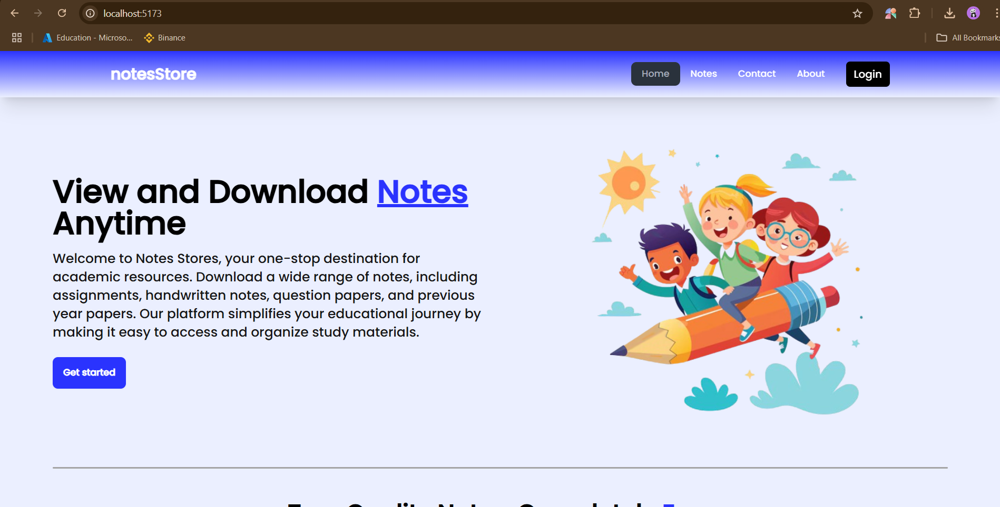
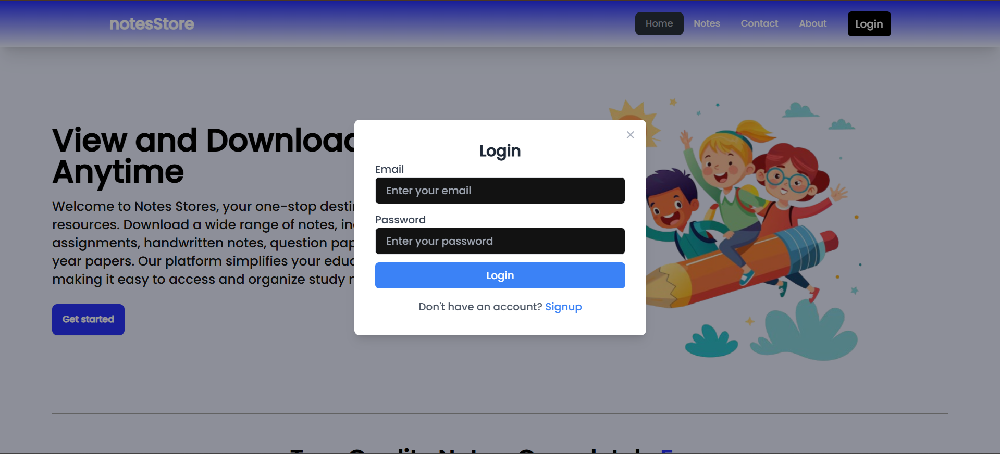
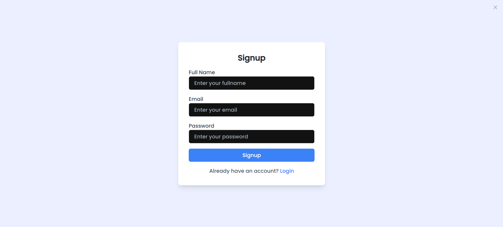

# NotesStore 📚  

NotesStore is a modern web application built using the MERN (MongoDB, Express.js, React.js, Node.js) stack. It provides students with a platform to access and store notes securely from anywhere, anytime. The project features a clean, user-friendly interface designed using Figma and includes animations to enhance the user experience.  

## 🌟 Key Features  

- 📝 **Access Notes Anytime**: Securely access and store notes from any device, anywhere.  
- 🔐 **Secure Authentication**: Signup and login functionality using JWT (JSON Web Tokens).  
- 🗂️ **Credential Storage**: User credentials are securely stored in MongoDB.  
- 🎨 **Attractive Design**: A sleek and intuitive user interface designed in Figma.  
- 🌟 **Animations**: Smooth animations for an engaging user experience.  

## 👩‍💻 Technologies Used  

- **Frontend**: React.js, Tailwind CSS  
- **Backend**: Node.js, Express.js  
- **Database**: MongoDB  
- **Authentication**: JWT (JSON Web Tokens)  
- **Design**: Figma  
- **Animations**: CSS animations

## 🚀 Getting Started  

Follow these steps to set up the project on your local machine.  

### Prerequisites  

Ensure you have the following installed:  
- Node.js  
- MongoDB  
- Git  

### Installation  

1. **Clone the repository**:
   ```bash
   git clone https://github.com/your-username/notesstore.git
   cd notesstore

2. **Install Dependencies of Backend**:
    - Backend
    ```bash
    cd Backend
    npm install

3. **Install Dependencies of Frontend**:
    ```bash
    cd ../Frontend
    npm install

4. **Set up environment variables**:
There is a .env file in the backend folder with the following:
    ```bash
    MONGO_URI=your_mongodb_connection_string
    PORT=4001

5. **Run the application**:
    - Backend:
    ```
    cd backend
    npm start

    - Frontend:
    ```
    cd frontend
    npm start

6. **Access the app**:
    Open your browser and navigate to http://localhost:5173

## 🎨 Screenshots  

- **Homepage**  
    

- **Login Page**  
    

- **Signup Page**  
    

## 👥 Project Team  

- **[Mohit Maurya](https://mohit-maurya-portfolio.vercel.app/)**  

- **[Mansi](https://github.com/Mansi200311)**  

## 📜 License  

This project is licensed under the MIT License. See the `LICENSE` file for more details.  

